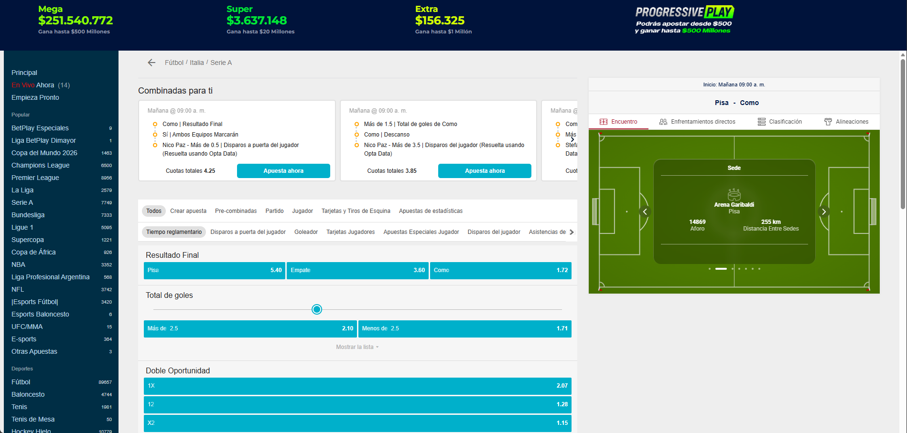
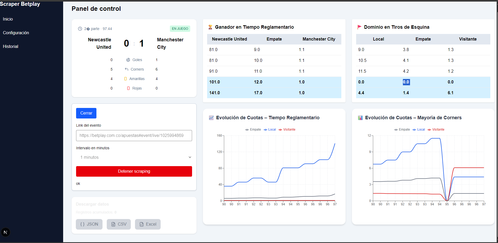

# ScrapingBetplay

Esta es una web simple que recibe un (En un futuro mas links) de un evento en Betplay y permite guardar la información a lo largo del tiempo.

La aplicación trabaja con el link del evento y aparti de ahí permite recopilar información a lo largo del tiempo de partido.

A continuación te propongo un **texto descriptivo, claro y formal**, adecuado para acompañar o presentar la información mostrada en el panel (por ejemplo, como explicación del dashboard, sección “Descripción” o introducción funcional).

---

El panel de control presenta un seguimiento en tiempo real de un evento deportivo obtenido mediante un proceso automatizado de scraping. En la parte superior se muestra el marcador del partido en curso, indicando el período de juego, el minuto actual y el estado del encuentro. Se visualiza el resultado parcial entre el equipo local y el visitante, junto con estadísticas clave del desarrollo del partido, como goles, tiros de esquina, tarjetas amarillas y tarjetas rojas, lo que permite una lectura inmediata de la dinámica del juego.

De manera complementaria, el panel incorpora información de mercados de apuestas relevantes. Se presenta la evolución de las cuotas para el mercado de ganador en tiempo reglamentario, desagregada por local, empate y visitante, permitiendo identificar cambios significativos en la percepción del resultado a medida que avanza el partido. Asimismo, se incluye el mercado de dominio en tiros de esquina, mostrando las cuotas correspondientes a cada resultado posible y resaltando los valores más recientes obtenidos por el scraper.

En la sección inferior, se visualizan gráficos de evolución temporal de las cuotas, tanto para el mercado de tiempo reglamentario como para el de mayoría de corners. Estos gráficos permiten analizar tendencias, saltos abruptos y variaciones asociadas a eventos del partido, facilitando un análisis histórico y comparativo del comportamiento de las cuotas minuto a minuto.

Finalmente, el panel integra un módulo de control del scraping, desde el cual se gestiona el enlace del evento, el intervalo de actualización y el estado del proceso. Se dispone de opciones para detener la extracción de datos y para descargar la información recolectada en distintos formatos, lo que convierte al panel en una herramienta integral para el monitoreo, análisis y explotación de datos en vivo.
